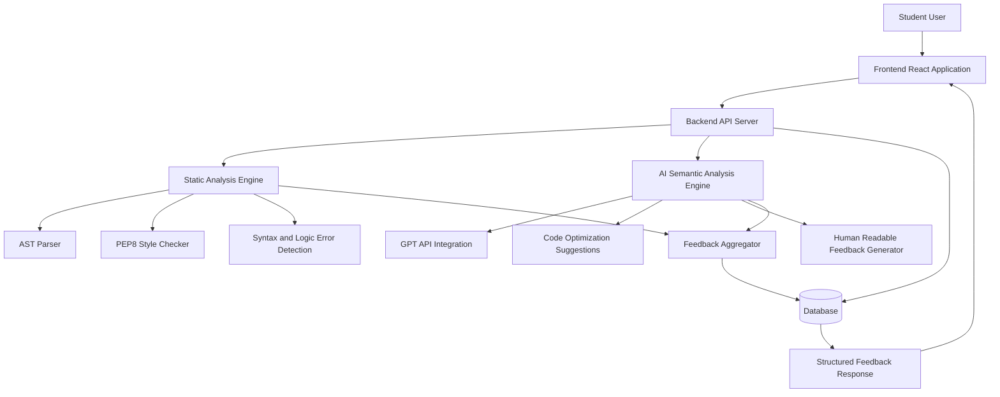

## 🏗️ System Architecture

The AI-Driven Code Reviewer follows a layered modular architecture. 
The system separates frontend, backend, static analysis, AI semantic analysis, and database components to ensure scalability and maintainability.
## 🏗️ System Architecture

### 🔍 Architecture Description

- **Frontend Layer**: Accepts student code and displays structured feedback.
- **Backend Layer**: Handles API requests and coordinates analysis modules.
- **Static Analysis Engine**: Performs AST parsing, syntax validation, and style checking.
- **AI Semantic Engine**: Uses GPT API to generate optimization suggestions and human-readable explanations.
- **Database Layer**: Stores code submissions and feedback history.

This layered design ensures modularity, scalability, and clear separation of concerns.
